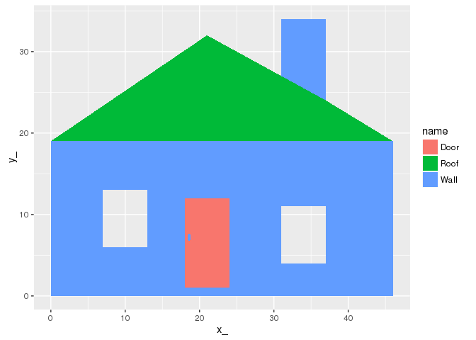

<!-- README.md is generated from README.Rmd. Please edit that file -->

------------------------------------------------------------------------

[](https://travis-ci.org/mdsumner/ggpolypath) [](https://ci.appveyor.com/project/mdsumner/ggpolypath) [](https://cran.r-project.org/package=ggpolypath) [](http://www.r-pkg.org/pkg/ggpolypath) [](https://codecov.io/github/mdsumner/ggpolypath?branch=master)

Polygons in 'ggplot2'
---------------------

It is possible to draw "polygons with holes" with `ggplot2`. Here we show two methods and explore some of the details.

1.  Write our own geom for `ggplot2` to deal with holes
2.  Use triangulation, so we only draw what's there.

For some background on the R graphics capabilities see <https://www.stat.auckland.ac.nz/~paul/R/Paths/MurrellPaths.pdf>.

Example polygons
----------------

The `polypath` function in R (introduced in `R` version `2.12.0`) provides a general facility to draw *polygon paths*, with a rule for how the space traversed is filled. The two rules are "evenodd" and "winding" (the non-zero rule). Generally, the evenodd rule is the most straightforward, and corresponds to expectations from using GIS software. The non-zero rule only really matters for self-intersecting paths, or when the orientation of a path is of interest[1].

The `polypath` function provides a simple example for drawing two rectangles in different situations, in order to illustrate the difference beween winding and evenodd[2]. Here we build data frames to store these examples, and include group and id attributes to distinguish close ring paths and the different situations.

The result in the examples looks like this:

``` r
example(polypath, echo = FALSE)
```


``` r
## taken from ?polypath
##"Nested rectangles, both clockwise")
library(tibble)
library(dplyr)
pts1 <- tibble(x = c(.1, .1, .9, .9, .2, .2, .8, .8),
              y = c(.1, .9, .9, .1, .2, .8, .8, .2), 
              group = c(1, 1, 1, 1, 2, 2, 2, 2), 
              id = 1)

# "Nested rectangles, outer clockwise, inner anti-clockwise")
pts2 <- tibble(x = c(.1, .1, .9, .9,  .2, .8, .8, .2),
               y = c(.1, .9, .9, .1,  .2, .2, .8, .8), 
              group = c(3, 3, 3, 3, 4, 4, 4, 4), 
              id = 2)
#               "Disjoint rectangles")
pts3 <- tibble(x = c(.1, .1, .4, .4, .6, .9, .9, .6),
               y = c(.1, .4, .4, .1,  .6, .6, .9, .9),
               group = c(5, 5, 5, 5, 6, 6, 6, 6), 
               id = 3)
#   "Overlapping rectangles, both clockwise")
pts4 <-   tibble(x = c(.1, .1, .6, .6, .4, .4, .9, .9),
               y = c(.1, .6, .6, .1, .4, .9, .9, .4),
               group = c(7, 7, 7, 7, 8, 8, 8, 8), 
               id = 4)
# "Overlapping rectangles, one clockwise, other anti-clockwise")
pts5 <- tibble(x = c(.1, .1, .6, .6, .4, .9, .9, .4),
               y = c(.1, .6, .6, .1, .4, .4, .9, .9),
               group = c(9, 9, 9, 9, 10, 10, 10, 10), 
               id = 5)
objects <- tibble(id = 1:5, 
                  description = c(
                    "Nested rectangles, both clockwise", 
                    "Nested rectangles, outer clockwise, inner anti-clockwise", 
                    "Disjoint rectangles", 
                    "Overlapping rectangles, both clockwise", 
                    "Overlapping rectangles, one clockwise, other anti-clockwise"
                  ))
pts <- bind_rows(pts1, pts2, pts3, pts4, pts5)
```

There's a problem with ggplot2 if we try to plot these naively.

``` r

library(ggplot2)

## this doesn't work at all
ggplot(inner_join(pts, objects)) + 
  aes(x = x, y = y, group = group, fill = factor(id)) + 
  geom_polygon() + facet_wrap(~ description, nrow = 5)
#> Joining, by = "id"
```



The problem is that `geom_polygon` uses `grid::polygonGrob` and this is not capable of drawing holes.

It's as if we decided to use `polygon`, it's not going to work. To illustrate here I use transparency so we can see the overlapping polygons as slightly darker regions.

``` r
split_insert_na <- function(x, f) {
  head(bind_rows(lapply(split(x, f), function(a) rbind(a, NA))), -1)
}

splitpts <- split(pts, pts$id)
op <- par(mfrow = c(5, 1), mar = rep(0.2, 4))
for (i in seq_along(splitpts)) {
  a <- splitpts[[i]]
  plot(a$x, a$y, axes = FALSE, xlab = "", ylab = "")
  polygon(split_insert_na(a, a$group), col = alpha("grey", 0.5))
  box()
}
```


``` r
par(op)
#lapply(split(spreadpts, spreadpts$id), function(a) polygon(split_insert_na(a, a$group), col = alpha("grey", 0.5)))
```

But, what if we use `polypath`?

Here I'm careful *not* to use transparency, as the behaviour is different on Windows for `windows()` and `png()` - effectively the results is as if we used the `evenodd` rule no matter what `rule` is set to.

The winding rule.

``` r
op <- par(mfrow = c(5, 1), mar = rep(0.2, 4))
for (i in seq_along(splitpts)) {
  a <- splitpts[[i]]
  plot(a$x, a$y, axes = FALSE, xlab = "", ylab = "")
  polypath(split_insert_na(a, a$group), col = "grey", rule = "winding")
  box()
}
```


``` r
par(op)
```

The evenodd rule.

``` r
op <- par(mfrow = c(5, 1), mar = rep(0.1, 4))
for (i in seq_along(splitpts)) {
  a <- splitpts[[i]]
  plot(a$x, a$y, axes = FALSE, xlab = "", ylab = "")
  polypath(split_insert_na(a, a$group), col = "grey", rule = "evenodd")
  box()
  }
```


``` r
par(op)
```

ggplot2?
--------

There's no way to use `geom_polygon` to get these "polygons with hole" effects. We write a new `geom_holygon`, [inspired by this post](http://qiita.com/kohske/items/9272e29a75d32416ff5e) - but also include application across different `id` values as well as different group values. This is exactly analogous to the need to call `polypath` multiple times above.

``` r
library(ggpolypath)
library(ggplot2)
library(grid)
descpoints <- inner_join(pts, objects) %>% mutate(border = 1)
#> Joining, by = "id"
ggplot(descpoints) + 
  aes(x = x, y = y, group = group, fill = factor(id), col = border) + 
  geom_polypath(rule = "winding") + facet_wrap(~ description, nrow = 5)
```


``` r


ggplot(descpoints) + 
  aes(x = x, y = y, group = group, fill = factor(id), col = border) + 
  geom_polypath(rule = "evenodd") + facet_wrap(~ description, nrow = 5)
```


[1] The orientation of a path becomes much more relevant in 3D, when the *inside* and the *outside* of a shape takes on another meaning.

[2] Winding vs. evenodd [wikipedia figure](https://commons.wikimedia.org/wiki/File:Even-odd_and_non-zero_winding_fill_rules.svg).
