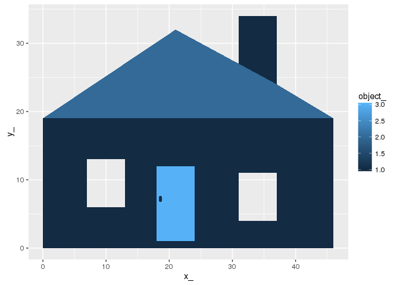

<!-- README.md is generated from README.Rmd. Please edit that file -->

------------------------------------------------------------------------

[](https://travis-ci.org/mdsumner/ggpolypath) [](https://ci.appveyor.com/project/mdsumner/ggpolypath) [](https://cran.r-project.org/package=ggpolypath) [](http://www.r-pkg.org/pkg/ggpolypath) [](https://codecov.io/github/mdsumner/ggpolypath?branch=master)

ggpolypath
----------

A `ggplot2` geom for polygons with holes.

Install
-------

``` r
## install from Github
devtools::install_github("mdsumner/ggpolypath")
```

Example
-------

``` r
library(ggpolypath)
#> Loading required package: ggplot2
data(maphome)

ggplot(maphome) + aes(x = x_, y = y_, group = branch_, fill = object_) +
  geom_polypath()
```



The same example, but using the linked per-object metadata.

``` r
ggplot(merge(maphome, dathome[, c("object_", "name")])) + 
  aes(x = x_, y = y_, group = branch_, fill = name) + 
  geom_polypath()
```


Gory details
------------

More examples, and more detail than you probably need can be found here:

<https://github.com/r-gris/polyggon/blob/master/README.md>
